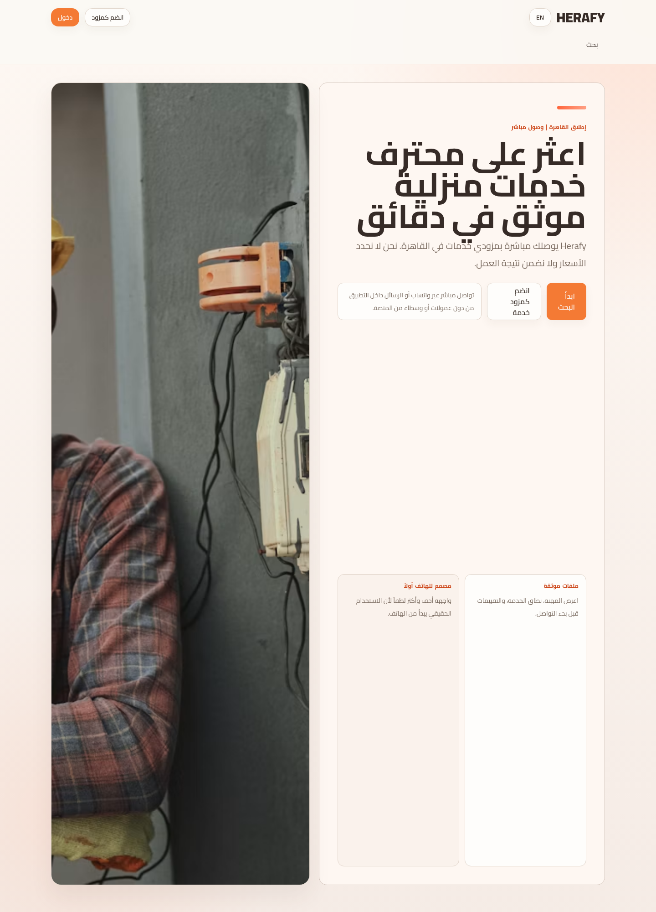

# Herafy

<p align="center">
  
</p>

Find a verified home-service professional in Cairo in minutes — then talk to them directly.

**Who it's for.** People in Cairo who need trusted home help quickly, plus providers who want verified listings and direct leads without platform middlemen.

This repository is Hand Connect, the TypeScript codebase behind Herafy.

## Try it

[Open Herafy](https://hand-connect-xi.vercel.app)

## What you get

- Search providers by profession and area — plumber, electrician, carpenter, cleaning
- Verified profiles with coverage and reviews before you start the conversation
- Direct WhatsApp or in-app messaging — no commissions, no middlemen
- Provider dashboard, admin review, and paid visibility tools
- Arabic-first, mobile-first web app, plus an iOS shell via Capacitor

## Run locally

```bash
npm install
npm run dev
```

Deployment and operations notes live in [docs/](docs/).

## How it works

Customers discover providers; contact starts on WhatsApp or in-app messages. The platform does not set prices or guarantee outcomes. Firebase backs auth, listings, reviews, and admin workflows. Admins review applications, reports, and visibility requests.

---

Built by [Ziad Ahmed](https://github.com/Ziad-NasrEldin) at [MaVoid](https://mavoid.com).

[Website](https://mavoid.com) · [LinkedIn](https://linkedin.com/in/ziad-ahmed-634202332) · [GitHub](https://github.com/Ziad-NasrEldin)
